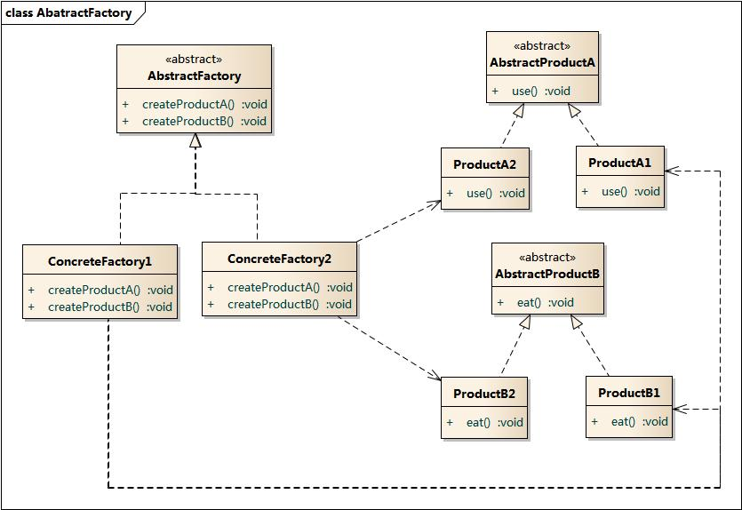

# 抽象工厂模式



## 代码：

IFactory
```java
package creational.abstractfactory;

public interface IFactory {
    public IProductA createProductA();
    public IProductB createProductB();
}

```

IProductA
```java
package creational.abstractfactory;

public interface IProductA {
    public void print();
}
```

IProductB
```java
package creational.abstractfactory;

public interface IProductB {
    public void print();
}
```

ConcreteFactoryA1B2
```java
package creational.abstractfactory;

public class ConcreteFactoryA1B2 implements IFactory {

    @Override
    public IProductA createProductA() {
        return new ConcreteProductALEVEL1();
    }

    @Override
    public IProductB createProductB() {
        return new ConcreteProductBLEVEL2();
    }

}

```

ConcreteFactoryA2B1
```java
package creational.abstractfactory;

public class ConcreteFactoryA2B1 implements IFactory {

    @Override
    public IProductA createProductA() {
        return new ConcreteProductALEVEL2();
    }

    @Override
    public IProductB createProductB() {
        return new ConcreteProductBLEVEL1();
    }
}

```

ConcreteProductALEVEL1
```java
package creational.abstractfactory;

public class ConcreteProductALEVEL1 implements IProductA {

    @Override
    public void print() {
        System.out.println("ConcreteProductA  LEVEL 1");
    }
}

```

ConcreteProductALEVEL2
```java
package creational.abstractfactory;

public class ConcreteProductALEVEL2 implements IProductA {

    @Override
    public void print() {
        System.out.println("ConcreteProductA--LEVEL 2");
    }
}

```

ConcreteProductBLEVEL1
```java
package creational.abstractfactory;

public class ConcreteProductBLEVEL1 implements IProductB {

    @Override
    public void print() {
        System.out.println("ConcreteProductA  LEVEL 1");
    }
}

```

ConcreteProductBLEVEL2
```java
package creational.abstractfactory;

public class ConcreteProductBLEVEL2 implements IProductB {

    @Override
    public void print() {
        System.out.println("ConcreteProductA  LEVEL 2");
    }
}

```

```java
package creational.abstractfactory;

public class Client {
    public static void main(String[] args){

        //如果我想组装一级的产品【由一级的ProductA和一级的ProductB组成】
        IFactory factoryA1B2= new ConcreteFactoryA1B2();
        IFactory factoryA2B1= new ConcreteFactoryA2B1();

        IProductA productA = factoryA1B2.createProductA();
        IProductB productB = factoryA2B1.createProductB();

        productA.print();
        productB.print();
    }
}

```


## 优点
+ 抽象工厂模式隔离了具体类的生成，使得客户并不需要知道什么被创建。由于这种隔离，更换一个具体工厂就变得相对容易。所有的具体工厂都实现了抽象工厂中定义的那些公共接口，因此只需改变具体工厂的实例，就可以在某种程度上改变整个软件系统的行为。另外，应用抽象工厂模式可以实现高内聚低耦合的设计目的，因此抽象工厂模式得到了广泛的应用。
+ 当一个产品族中的多个对象被设计成一起工作时，它能够保证客户端始终只使用同一个产品族中的对象。这对一些需要根据当前环境来决定其行为的软件系统来说，是一种非常实用的设计模式。
+ 增加新的具体工厂和产品族很方便，无须修改已有系统，符合“开闭原则”。
## 缺点
+ 在添加新的产品对象时，难以扩展抽象工厂来生产新种类的产品，这是因为在抽象工厂角色中规定了所有可能被创建的产品集合，要支持新种类的产品就意味着要对该接口进行扩展，而这将涉及到对抽象工厂角色及其所有子类的修改，显然会带来较大的不便。
+ 开闭原则的倾斜性（增加新的工厂和产品族容易，增加新的产品等级结构麻烦）。
## 适用环境
+ 一个系统不应当依赖于产品类实例如何被创建、组合和表达的细节，这对于所有类型的工厂模式都是重要的。
+ 系统中有多于一个的产品族，而每次只使用其中某一产品族。
+ 属于同一个产品族的产品将在一起使用，这一约束必须在系统的设计中体现出来。
+ 系统提供一个产品类的库，所有的产品以同样的接口出现，从而使客户端不依赖于具体实现。

## 总结：
#### 1. 工厂模式：
工厂模式根据抽象程度的不同分为三种：简单工厂模式（也叫静态工厂模式）、工厂方法模式、以及抽象工厂模式。

#### 2. 抽象工厂模式与工厂方法模式的区别
抽象工厂模式是工厂方法模式的升级版本，他用来创建一组相关或者相互依赖的对象。他与工厂方法模式的区别就在于，工厂方法模式针对的是一个产品等级结构；而抽象工厂模式则是针对的多个产品等级结构。在编程中，通常一个产品结构，表现为一个接口或者抽象类，也就是说，工厂方法模式提供的所有产品都是衍生自同一个接口或抽象类，而抽象工厂模式所提供的产品则是衍生自不同的接口或抽象类。

当抽象工厂模式中每一个具体工厂类只创建一个产品对象，也就是只存在一个产品等级结构时，抽象工厂模式退化成工厂方法模式；当工厂方法模式中抽象工厂与具体工厂合并，提供一个统一的工厂来创建产品对象，并将创建对象的工厂方法设计为静态方法时，工厂方法模式退化成简单工厂模式。
